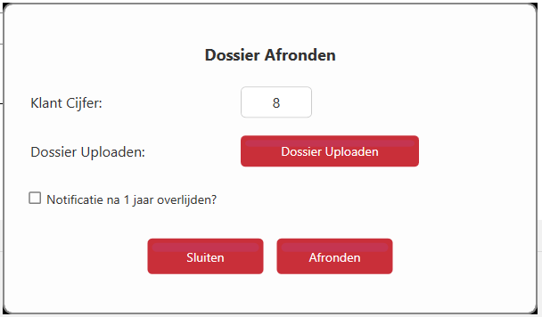

# Dossier afronden
Wanneer je de gegevens hebt ingevuld en je wilt het dossier opslaan dan klik je op “Opslaan” wanneer je de uitvaart hebt afgerond en je wilt het dossier afsluiten dan klik je op “Afronden”

  

Bij het afronden moet je het klant cijfer invullen en het complete dossier als PDF uploaden, zonder die data kan je niet afronden.
Daarnaast is er nog de optie tot het instellen van een notificatie, één jaar na het overlijden krijg je een melding zodat je eventueel contact kunt opnemen.

Wanneer je op Dossier Uploaden klikt zal er een venster openen waar je je PDF bestand kunt aangeven.
Deze zal vervolgens worden gekopieerd naar de dossier folder, na deze handeling is het dossier gesloten en wordt je terug gestuurd naar het beging scherm.
