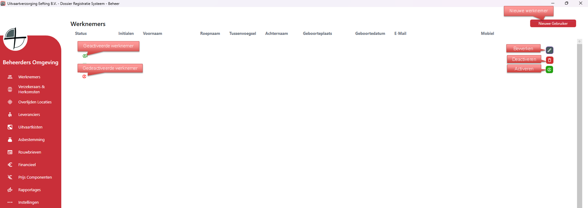

# Beheer - Gebruikers
Via Gebruikers kun je alle medewerkers aanmaken, bewerken en verwijderen.

Als je rechts op bewerken klikt kan je de gegevens van die specifieke medewerker bewerken;

  

<table>
  <tr>
    <td>
      
    </td>
    <td>
      Vul de gevraagde gegevens in. 
      Let op: vink de juiste checkboxes anders komen de werknemers niet voor in de verschillende selectieboxen. 
      Zet de rechten van de medewerker goed, dit bepaald wat de gebruiker kan doen en mag zien binnen het systeem. 
    </td>
  </tr>
</table>
