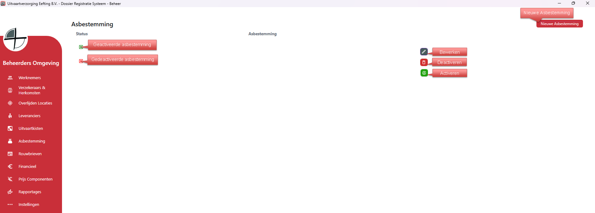

# Beheer - Asbestemming
Via Asbestemmingen kun je alle asbestemmingen aanmaken, bewerken en verwijderen.

Als je rechts op bewerken klikt kan je de gegevens van die specifieke asbestemming bewerken;

  

<table>
  <tr>
    <td>
      
    </td>
  </tr>
</table>
