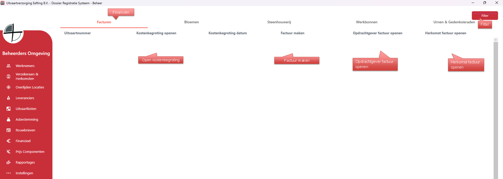
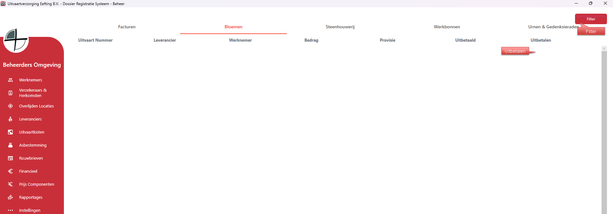
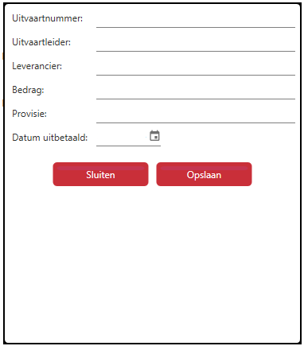

# Beheer - Financieel
Het eerste tabblad zijn de facturen, wanneer de kostenbegroting gemaakt is wordt deze zichtbaar onder facturen.

Wanneer de factuur gemaakt is worden de knoppen beschikbaar om de facturen te openen, afhankelijk welke verzekering gekozen is met factuur type komen er één of twee facturen uit.

Bloemen / Steenhouwerij en Urnen & Gedenkstenen bevatten de financiele gegevens van de verkochte eenheden.

Wanneer er iets bij de steenhouwerij verkocht is dan wordt de data weergegeven (dit geld ook voor Bloemen en Urnen & Gedenkstenen)

  

  

<table>
  <tr>
    <td>
      
    </td>
    <td>
      Wanneer je op Uitbetalen klikt van de betreffende uitvaart worden de gegevens zichtbaar; 
      Een aantal velden zijn grijs want dat is informatie, de financiele velden zijn bewerkbaar, zo kan je invullen wat de provisie is en wanneer het uitbetaald is.
    </td>
  </tr>
</table>
 
*Elk tabblad van financien heeft een Export knop die de data exporteert naar Excel.
