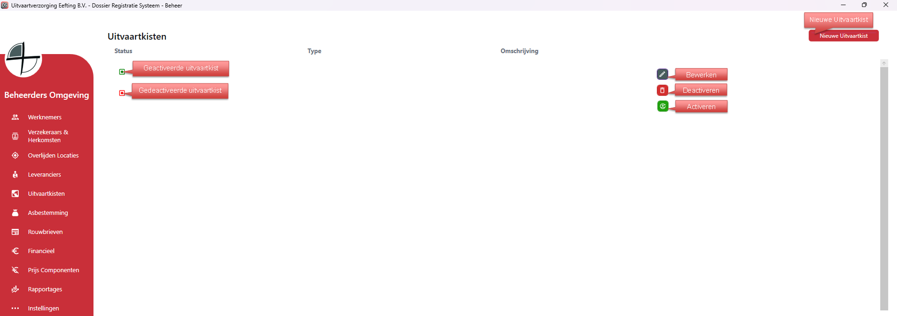
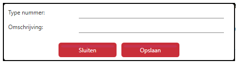

# Beheer - Kisten
Via Uitvaartkisten kun je alle uitvaartkisten aanmaken, bewerken en verwijderen.

Als je rechts op bewerken klikt kan je de gegevens van die specifieke uitvaartkist bewerken;

  

<table>
  <tr>
    <td>
      
    </td>
    <td>
        Zorg ervoor dat Type nummer uniek is.
    </td>
  </tr>
</table>
