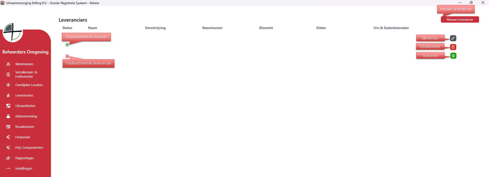
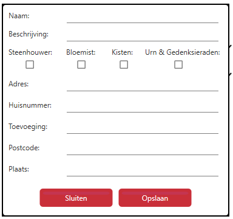

# Beheer - Leveranciers
Via Leveranciers kun je alle leveranciers aanmaken, bewerken en verwijderen.

Als je rechts op bewerken klikt kan je de gegevens van die specifieke leverancier bewerken;

  

<table>
  <tr>
    <td>
      
    </td>
    <td>
      Vul de gevraagde gegevens in. 
      Vink de checkboxes waar de leverancier zichtbaar moet zijn, zodat er opdrachten voor gemaakt kunnen worden.
    </td>
  </tr>
</table>
