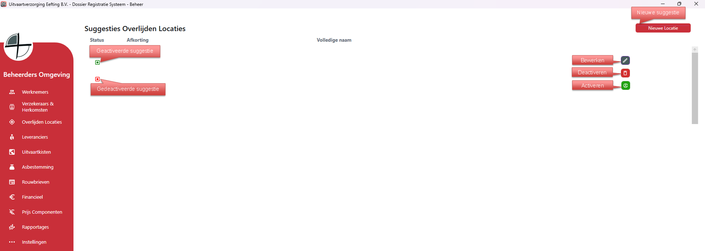
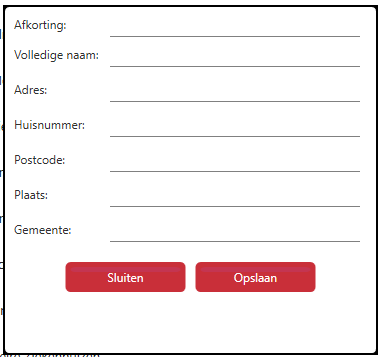

# Beheer - Locaties / Suggesties
Via Overlijden Locaties kun je locaties aanmaken, bewerken en verwijderen. 
Deze locaties worden gebruikt om snel en efficient adres gegevens op te zoeken bij plaats van overlijden, bijvoorbeeld UMCG geeft direct het adres.

Als je rechts op bewerken klikt kan je de gegevens van die specifieke locatie bewerken;

  

<table>
  <tr>
    <td>
      
    </td>
    <td>
      Vul de gevraagde gegevens in. 
      <ul>
      <li>Afkorting (Bv. UMCG)</li>
      <li>Volledige Naam (Bv. Universitair Medisch Centrum Groningen)</li>
      <li>Adres (Bv. Hanzeplein)</li>
      <li>Huisnummer - (Bv. 1)</li>
      <li>Postcode - (Bv. 9713 GZ)</li>
      <li>Plaats - (Bv. Groningen)</li>
      <li>Gemeente - (Bv. Groningen)</li>
      </ul>
    </td>
  </tr>
</table>
