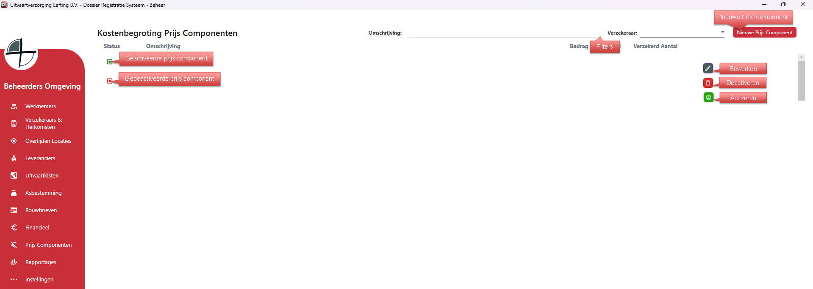
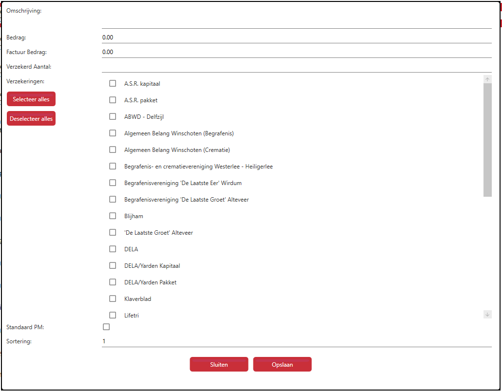

# Beheer - Prijs Componenten
Via Prijs Componenten kun je alle prijs componenten aanmaken, bewerken en verwijderen.

Als je rechts op bewerken klikt kan je de gegevens van die specifieke prijs component bewerken;

  

<table>
  <tr>
    <td>
      
    </td>
    <td>
      Vul in de gegevens zoals gevraagd; 
      <tr><td>Omschrijving</td><td>bv. Akte van Cessie</td></tr>
      <tr><td>Bedrag</td><td>standaard bedrag wat op de kostenbegroting moet komen</td></tr>
      <tr><td>Factuur Bedrag</td><td>bedrag wat ongeacht de kostenbegroting op de factuur moet komen te staan</td></tr>
      <tr><td>Verzekerd Aantal</td><td>aantal dat verzekerd is, bv. 2 rouwauto's</td></tr>
      <tr><td>Verzekeringen</td><td>vink aan voor welke herkomsten het prijs component geldig is</td></tr>
      <tr><td>Standaard PM</td><td>vink aan als het een standaard PM bedrag is bijv. Koffie & Koek</td></tr>
      <tr><td>Sortering</td><td>hoe hoog of laag het op de kostenbegroting moet staan, 1 is bovenaan, 2 daaronder etc.</td></tr>
    </td>
  </tr>
</table>
