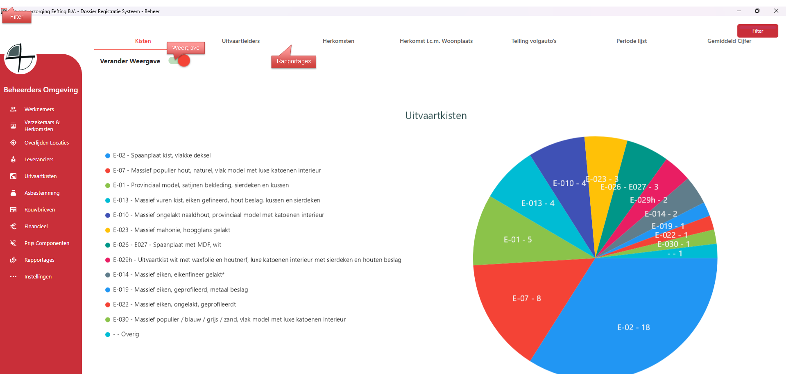

# Beheer - Prijs Componenten
Via rapportages kun je de benodige rapportages en statestieken bekijken over welke uitvaart, welke herkomsten, welke kisten etc.

Ook is er de optie om te filteren tussen bepaalde uitvaart nummers;

  

Via rapportages kun je de benodige rapportages en statestieken bekijken over welke uitvaart, welke herkomsten, welke kisten etc.

Ook is er de optie om te filteren tussen bepaalde uitvaart nummers 
Op het tabblad gemiddelde cijfers, worden de scores berekend van de uitvaartleiders 
Via de knop Specificatie kan je een drilldown doen naar welke uitvaart welke score heeft gegeven.
