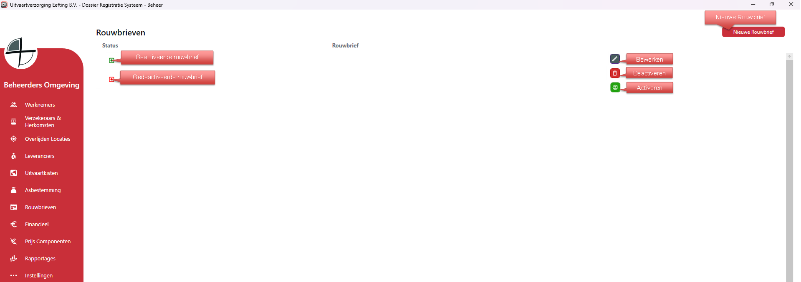
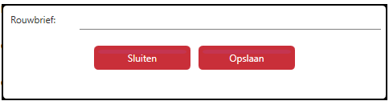

# Beheer - Rouwbrieven
Via Rouwbrieven kun je alle rouwbrieven aanmaken, bewerken en verwijderen.

Als je rechts op bewerken klikt kan je de gegevens van die specifieke rouwbrief bewerken;

  

<table>
  <tr>
    <td>
      
    </td>
  </tr>
</table>
