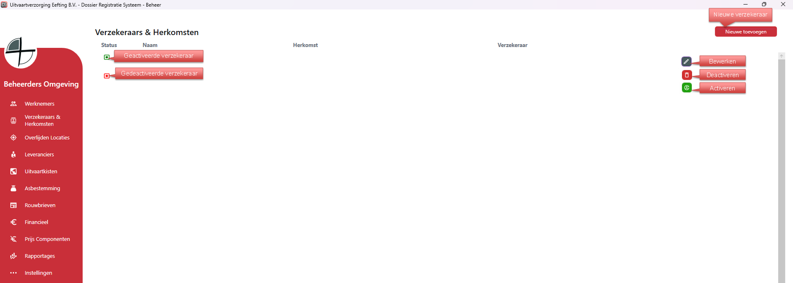
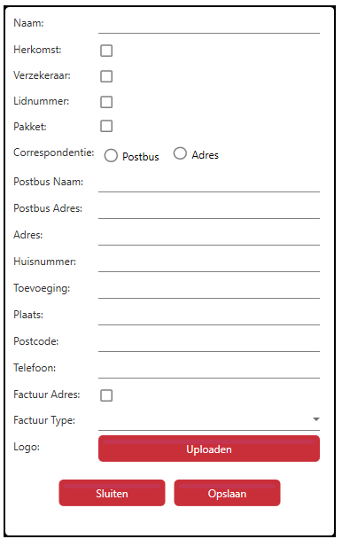

# Beheer - Verzekeraars & Herkomsten
Via Verzekeraars & Herkomsten kun je alle verzekeraars en herkomsten aanmaken, bewerken en verwijderen.

Als je rechts op bewerken klikt kan je de gegevens van die specifieke verzekeraar bewerken;

  

<table>
  <tr>
    <td>
      
    </td>
    <td>
  Voor het aanmaken van een nieuwe verzekeraar of herkomst moet je de gegevens invullen.
  <ul>
    <li>Herkomst</li>
    <li>Verzekeraar</li>
    <li>Lidnummer</li>
    <li>Pakket</li> 
  </ul>
  *Als het een pakket verzekering is dan klik ook Pakket aan
    
  Vink Factuur adres aan als dat adres standaard op de factuur moet komen te staan.
    
  Factuur Type voor hoe de facturatie moet gaan;
  <ul>
    <li>Opdrachtgever</li>
    <li>Opdrachtgever & Vereniging</li>
    <li>Vereniging</li>
  </ul>
    </td>
  </tr>
</table>
