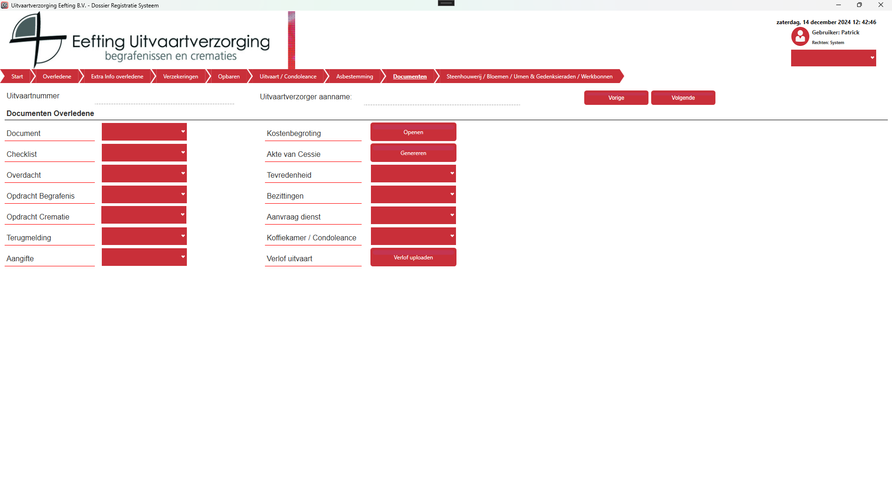
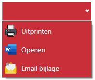

# Documenten

  

Alle documenten worden gegenereerd vanuit de applicatie.
Per document type heb je een aantal keuzes;

  

| Functie         | Beschrijving                                                                                              |
|-----------------|----------------------------------------------------------------------------------------------------------|
| **Uitprinten**  | Uitprinten geeft een scherm weer waar je de printer kunt kiezen en daarna wordt het document direct uitgeprint. |
| **Openen**      | Openen opent het bestand als een Word-bestand, wil je iets met de hand aanpassen dan kan dat via deze optie. |
| **Email bijlage** | Email als bijlage opent een nieuwe email en stopt daar het Word-bestand in als een bijlage.               |

Het systeem controleerd als het bestand al bestaat, als deze versie gelijk is met wat het systeem verwacht dan wordt die gebruikt, mocht je aanpassingen hebben gedaan in het Word bestand dan wordt dit gedetecteerd door het systeem.
