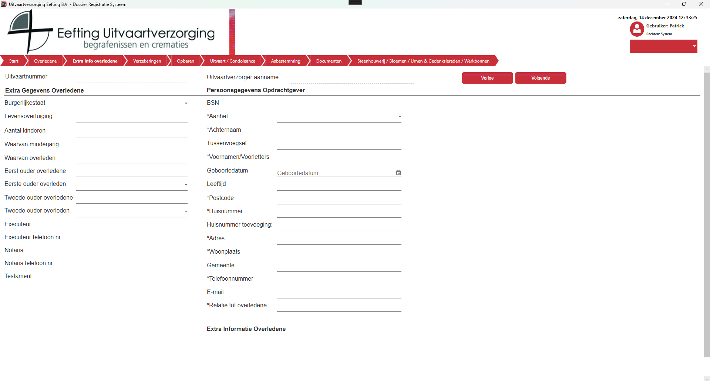

# Extra Info
Op het moment dat je rechtsboven in op Volgende klik wordt de data die je hebt ingegeven direct opgeslagen in de database en ga je door naar het volgende scherm.

  

Vanaf dat moment zal je ook op elk venster het ingevulde uitvaartnummer en uitvaartverzorger zien die het heeft aangenomen.
Onder het vak ***Extra Informatie Overledene*** staat de knop
Deze knop opent een pop-up venster en geeft de mogelijkheid tot het invullen (gedeeltelijk) van een extra contactpersoon.
