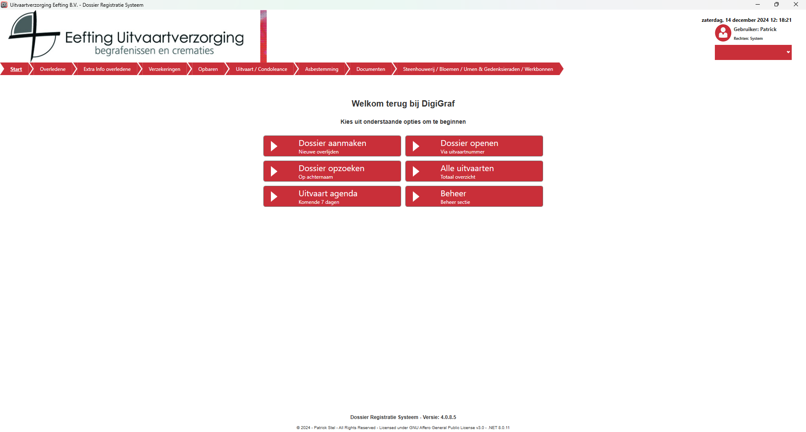
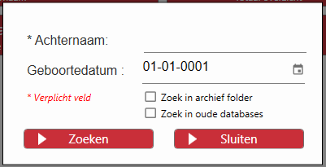
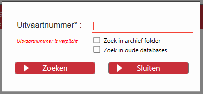

# Handleiding
Deze handleiding helpt u om snel vertrouwd te raken met de belangrijkste functies en navigatie van DigiGraf, zodat u optimaal gebruik kunt maken van onze software voor dossierbeheer in de uitvaartverzorging.

### Actieknoppen binnen Dossiers
Bij het werken met dossiers zijn er een aantal veelgebruikte actieknoppen die u helpen om dossiers snel en eenvoudig te beheren:

  - Dossier aanmaken: Maak een nieuw dossier aan voor een overledene. U wordt gevraagd om persoonlijke gegevens en uitvaartdetails in te voeren.
  - Dossier openen: Directe zoekopdracht op uitvaartnummer.
  - Dossier opzoeken: Directe zoekopdracht op achternaam met eventueel geboortedatum.
  - Alle uitvaarten: Toont alle uitvaarten die aanwwezig zijn in het systeem.
  - Uitvaart agenda: Toont alle uitvaarten van de komende 7 dagen.
  - Beheer: Opent de beheer afdeling.

  
  

  
### Ondersteuning
Voor verdere vragen kunt u altijd de ingebouwde helpfunctie gebruiken via Help in het hoofdmenu of contact opnemen met ons ondersteuningsteam via de GitHub pagina.
Met DigiGraf is dossierbeheer eenvoudig en georganiseerd, zodat u zich volledig kunt richten op het bieden van de beste dienstverlening voor uw klanten.
