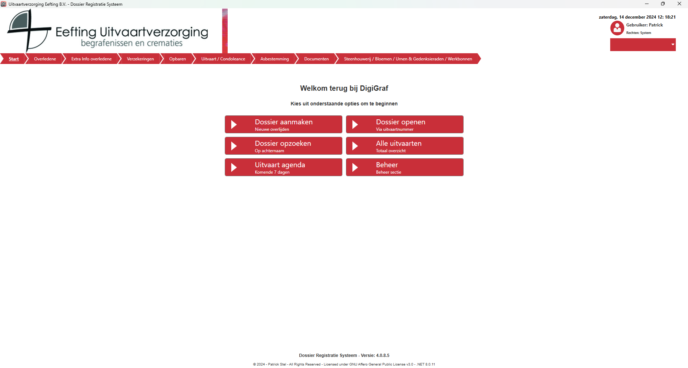
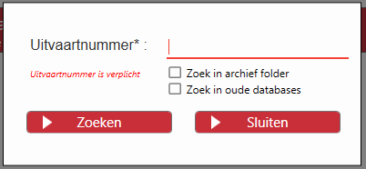
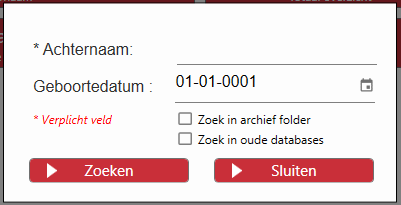
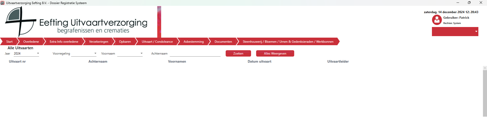
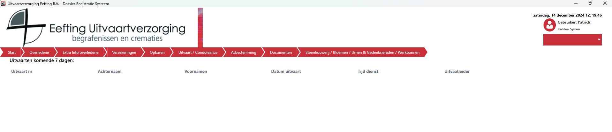
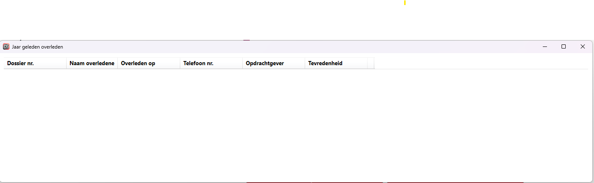
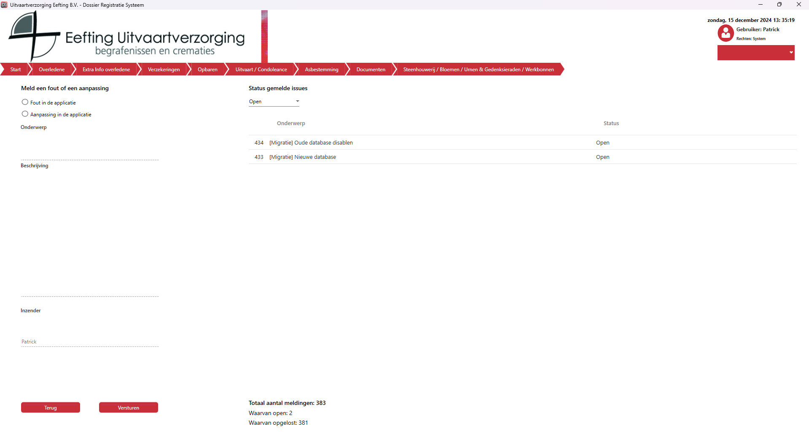

Onderwerpen
- [Start scherm](#start)
- [Dossier openen](#openen)
- [Dossier opzoeken](#opzoeken)
- [Alle uitvaarten](#uitvaarten)
- [Agenda](#agenda)
- [Notificatie](#notificatie)
- [Help](#help)

## Start scherm {#start}

  Bij het openen van de applicatie is dit het eerste scherm wat je ziet. 
  Afhankelijk van welke rechten je hebt zie je rechts in de dropdown box;
  <table>
    <tr>
      <td>Start</td>
      <td>Thuis scherm van de applicatie (begin punt)</td>
    </tr>
    <tr>
      <td>Agenda</td>
      <td>Uitvaarten van de komende 7 dagen</td>
    </tr>
    <tr>
      <td>Alle Uitvaarten</td>
      <td>Alle uitvaarten bekend in het systeem</td>
    </tr>
    <tr>
      <td>Notificaties</td>
      <td>Weergave van de 1 jaar geleden overlenen (voor de ingelogde uitvaartverzorger)</td>
    </tr>
    <tr>
      <td>Help</td>
      <td>Probleem melden of een toevoeging aanvragen</td>
    </tr>
    <tr>
      <td>Handleiding</td>
      <td>Digitale handleiding</td>
    </tr>
    <tr>
      <td>Beheer</td>
      <td>Regel de configuratie van de applicatie (Werknemers etc.)</td>
    </tr>
  </table>
  Op het start scherm staan de volgende zes knoppen namelijk;
  <table>
    <tr>
      <td>Dossier aanmaken (Nieuwe overlijden)</td>
      <td>Creëer een nieuw dossier</td>
    </tr>
    <tr>
      <td>Dossier openen (Via uitvaartnummer)</td>
      <td>Open een bestaand dossier via het uitvaartnummer</td>
    </tr>
    <tr>
      <td>Dossier opzoeken (Op achternaam)</td>
      <td>Open een bestaand dossier via de achternaam</td>
    </tr>
    <tr>
      <td>Alle uitvaarten (Totaal overzicht)</td>
      <td>Geeft een overzicht van alle uitvaarten in het systeem</td>
    </tr>
    <tr>
      <td>Uitvaart agenda</td>
      <td>Uitvaarten van de komende 7 dagen</td>
    </tr>
    <tr>
      <td>Beheer</td>
      <td>Regel de configuratie van de applicatie (Werknemers etc.)</td>
    </tr>
  </table>

## Dossier openen {#openen}

  Wanneer er voor “Dossier openen” gekozen is dan wordt een om een Uitvaartnummer gevraagd, dit nummer is verplicht. 
  Daarnaast is er nog de optie om te zoeken in de archief folder (PDF bestanden) of in de oude archief databases. 
  

## Dossier opzoeken {#opzoeken}

  Wanneer er voor “Dossier opzoeken” gekozen is dan wordt er om een Achternaam en Geboortedatum gevraagd,  Let op: Achternaam is verplicht maar Geboortedatum niet. 
   
  Wanneer er meer dan één dossier gevonden wordt met de gegevens dan krijgt de gebruiker dit te zien middels een popup met daarin alle gegevens en een knop om het betreffende dossier te openen in de applicatie of in de oude database als het een oud dossier is.

## Alle uitvaarten {#uitvaarten}

  Alle uitvaarten laat een overzicht zien van alle uitvaarten die in het systeem zitten. 
   
  Met de knop “Openen” ga je rechtstreeks naar het dossier van de betreffende uitvaart.
  Met de filters bovenin kun je filteren op alle uitvaarten die erin staan als;
  <ul>
    <li>Voorregeling (a-z)</li>
    <li>Voornaam (a-z)</li>
    <li>Achternaam (invul veld)</li>
  </ul> 
  Wil je de filters opheffen klik dan op de knop “Alles Weergeven”

## Agenda {#agenda}

  De agenda laat de aankomende uitvaarten zien van de komende 7 dagen. 
   
  De sortering werkt op datum en vervolgens op tijd, als er dus 2 of meer op dezelfde dag zijn dan wordt het gesorteerd op de tijd. 
  Met de knop “Openen” ga je rechtstreeks naar het dossier van de betreffende uitvaart.

## Notificatie {#notificatie}

  Notificaties geeft een weergave van de overleden personen van één jaar geleden aan de uitvaartleider die de uitvaart gedaan heeft 
  De notifcatie geven een tijdspan van 14 dagen,  7 dagen voor overlijden en 7 dagen erna. 
  

## Help {#help}

  Met Help kun je een verzoek doen voor een nieuwe toevoeging of een fout melden in het systeem (de meeste systeem fouten worden ook automatisch gemeld). 
   
  Mocht je een leuk idee hebben voor de applicatie dan kan je het hier dus aangeven en dan kan er naar gekeken worden. 
  <b>Gebruik dit dus vooral als het systeem crasht (afsluit) geef duidelijk aan wat je hebt gedaan en wat je hebt ingevuld.</b>

