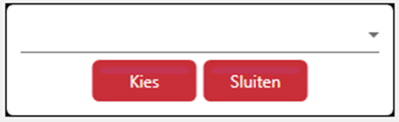
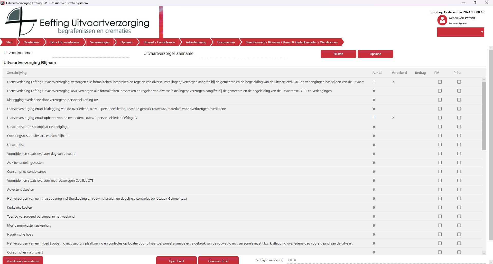

# Kostenbegroting
Wanneer je de kostenbegroting hebt geopend en er is geen kostenbegroting eerder gemaakt wordt dit scherm weergegeven;

  

Hier maak je een keuze van welke kostenbegroting je wilt hebben.
Afhankelijk van welke kostenbegroting je hebt gekozen zal je iets zien wat hier op lijkt;

  

De gevraagde gegevens bestaan uit;
Omschrijving - Tekst
Aantal - Numeriek
Verzekerd - X (X = Ja, Leeg = Nee)
Bedrag - decimalen (10,00)
PM - Check als het een PM bedrag is
Print - Check als aantal leeg is, Verzekerd leeg is, Bedrag leeg is en PM niet aangevinkt is, maar toch op het Excel formulier moet komen.

Heb je perongeluk de verkeerde verzekeraar gekozen dan kun je op “Verzekering veranderen” klikken. Je krijgt dan het eerste schermpje weer te zien;

Wanneer je de kostenbegroting gemaakt hebt zoals je wilt klik je op “Genereer Excel”. Je krijgt vervolgens een Excel bestand die voorzien is van alle gegevens zoals je hebt ingevuld is en voldoet aan de standaard.

Mocht je een aanpassing willen doen in de kostenbegroting dan kan je dat doen in de applicatie en vervolgens klik je weer op Genereer Excel, de oude wordt dan verwijderd en een nieuwe klaargezet.

***Let op:*** De aanpassingen die je doet textueel of toevoegingen o.i.d. geld alleen voor de kostenbegroting van het nummer waar je aan werkt, wil je aan algemene aanpassing ga dan via Beheer -> Prijs componenten
