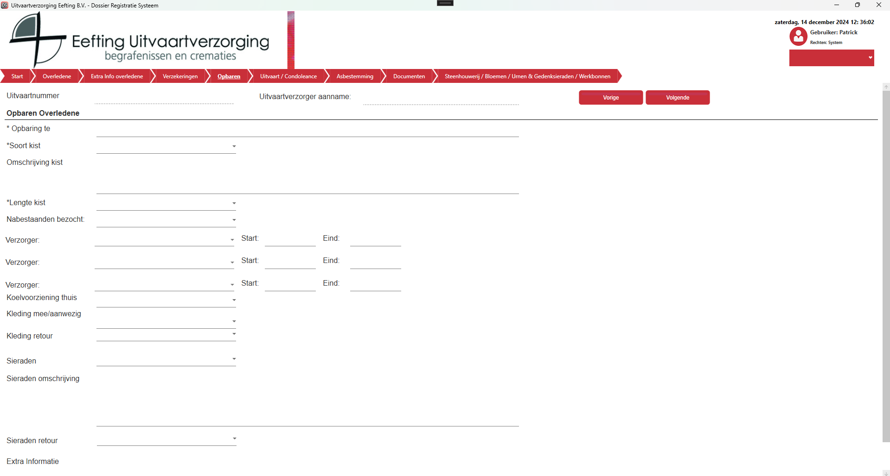

# Opbaren
Voor het opbaren worden de medewerkers weergegeven, wanneer er een verzorger geselecteerd is dan moet ook de start en eind tijd opgegeven worden.
Wanneer een “Soort Kist” gekozen wordt zal de “Omschrijving Kist” automatisch gevuld worden, deze tekst kan je uiteraard zelf aanpassen.

  

