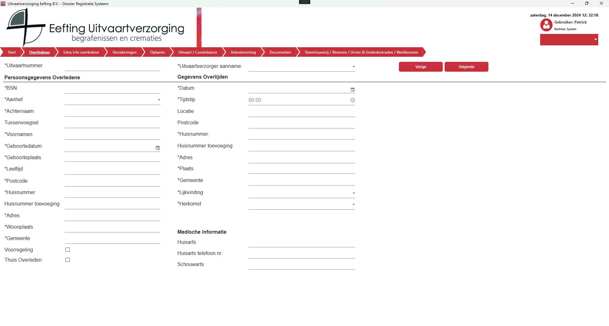

# Dossier aanmaken
Indien er gekozen is voor “Dossier aanmaken” dan zal er een nieuw dossier geopend worden.

  

Vul de gevraagde gegevens in.
-	Indien het een nederlandse postcode en huisnummer betreft wordt Adres, Woonplaats en Gemeente automatisch gevuld. (mits de gegevens gevonden kunnen worden)
-	Als er een valide Geboortedatum ingevuld wordt (dd-mm-jjjj) dan wordt de leeftijd automatisch berekend.
-	Als er een herkomst gekozen wordt waar een lidnummer bij hoort dan wordt dat veld zichtbaar.
