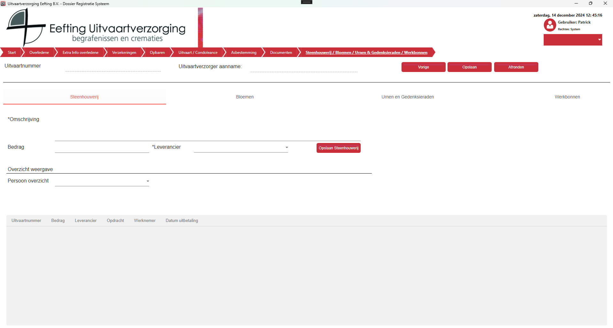
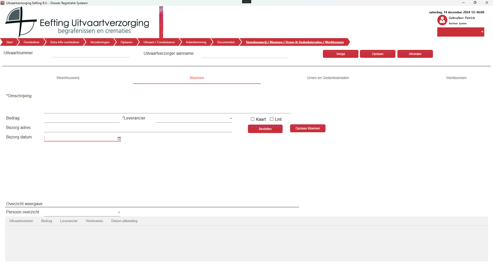
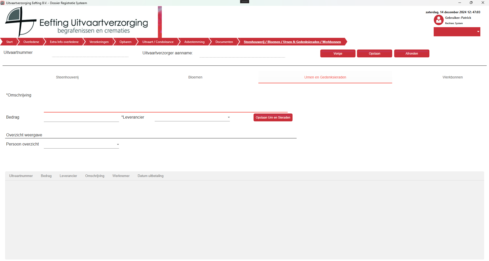

Het scherm voor Steenhouwerij / Bloemen / Werkbonnen ziet er iets anders uit dan de andere schermen.
Je hebt hier vier tabbladen respectievelijk voor Steenhouwer, Bloemen, Urnen en Gedenksieraden én Werkbonnen.

Per tabblad heb je een knop om de gegevens op te slaan, wanneer je gegevens invult en daarna van tabblad veranderd dan worden je gegevens niet automatisch opgeslagen, je moet echt op Opslaan klikken.

# Steenhouwerij

  

# Bloemen

  

# Urnen en Gedenksieraden

  

Per view bestaat er een optie om een overzicht op te vragen van je collega's om te zien hoeveel hun verkopen.
