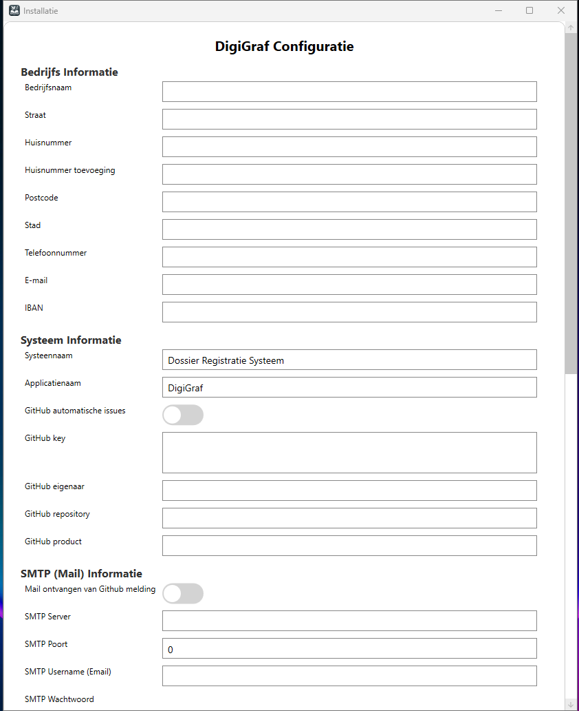
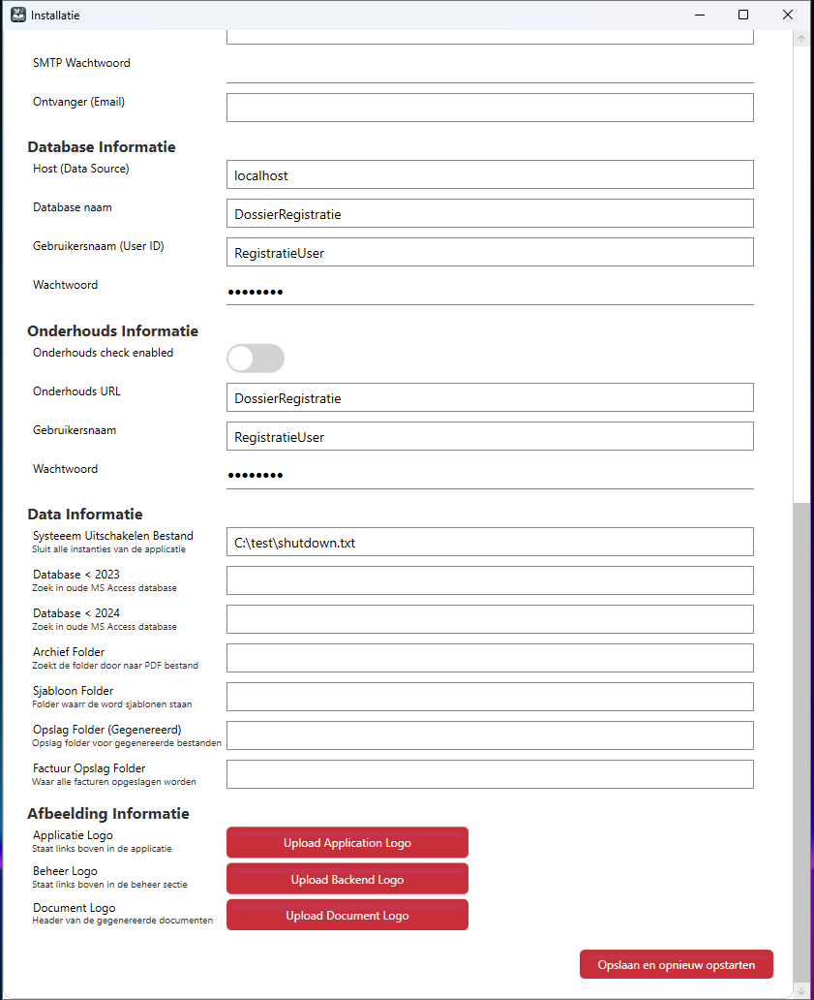

## DigiGraf Installatie
Welkom bij DigiGraf! Volg de onderstaande stappen om de software correct te installeren en direct te beginnen met het beheren van uw dossiers voor de uitvaartverzorging.

### Systeemvereisten
- Besturingssysteem: Windows 10 of hoger 64-bit versie aanbevolen
- Database: Microsoft SQL Server (minimaal versie 2019)
- .NET Framework: Versie 8.0 of hoger moet geïnstalleerd zijn

### Downloaden
Download de Installer
- Ga naar de officiële [DigiGraf-pagina Releases](https://github.com/PatrickSt1991/Uitvaartverzorging-Dossier-Registratie/releases) om de laatste release te downloaden.
- Restore de .bak op de SQL Server en maak SQL credentials aan
- Pak de zip uit op de server of computer en start Dossier.Registratie.exe

### Eerste keer openen
 - Tijdens de eerste keer openen wordt u gevraagd om de verbindingsinstellingen voor de database in te voeren. Vul de volgende informatie in:
  - Servernaam: De naam of het IP-adres van de SQL Server
  - Database: Naam van de database (standaard: DossierRegistratie)
  - Gebruikersnaam en wachtwoord: Voer de inloggegevens in voor de SQL-databasegebruiker
  - Tijdens de installatie opent DigiGraf de configuratiebestanden
  - Vul de verschillende onderdelen in zoals gevraagd, niet alles is verplicht

  
  

 - Na dat alle gevraagde gegevens zijn ingevuld klikt u op Opslaan en opnieuw opstarten
 - DigiGraf start zich nu opnieuw op met de initiële configuratie

### Veelvoorkomende Problemen en Oplossingen
 - Probleem: DigiGraf kan geen verbinding maken met de database.
  - Oplossing: Controleer of de SQL Server actief is en of de verbindingsinstellingen correct zijn ingevoerd. Zorg ervoor dat de juiste poorten op de firewall zijn geopend.

 - Probleem: .NET Framework 8.0 is niet geïnstalleerd.
  - Oplossing: Download en installeer de laatste versie van [.NET Framework 6.0](https://dotnet.microsoft.com/en-us/download/dotnet/8.0) via de officiële Microsoft-website en probeer de installatie opnieuw.
    
### Ondersteuning
Voor verdere ondersteuning kunt u contact opnemen met ons ondersteuningsteam via de GitHub pagina.
Bedankt dat u voor DigiGraf heeft gekozen – wij wensen u een succesvolle start met ons dossierregistratiepakket!
