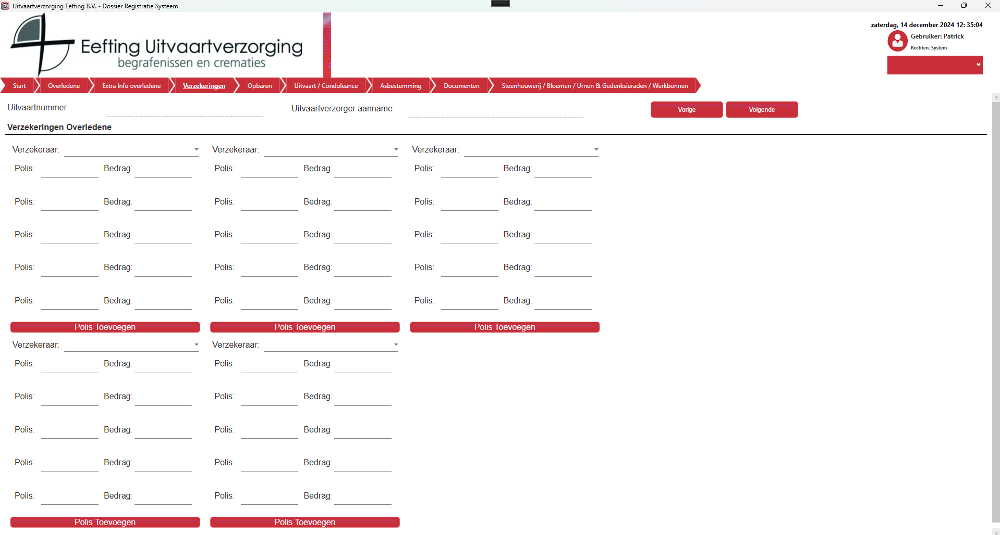

# Verzekeringen
Per overledene kunnen er vijf verzekeraars gekozen worden, per gekozen verzekeringen komen er standaard vijf polissen, in gevallen dat dit niet genoeg is dan maak dan gebruik van de knop Polis Toevoegen.

  

